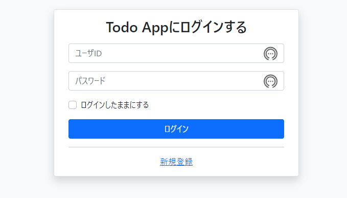
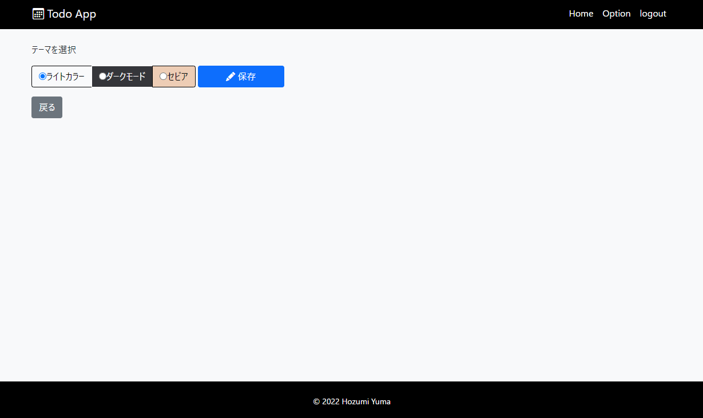
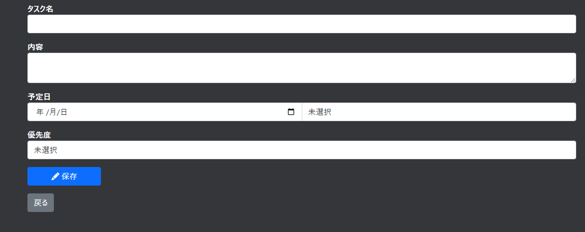

# 概要
本レポジトリは、私が個人開発したTodo Appのコードを公開している場所になります。
サイトのURLは<a href="https://mywebapp.hzmintech.com/">こちら</a>。

このWeb Appでは以下のような機能を実装しています。
- ユーザのログイン認証
- タスクの新規追加
- タスクの編集
- タスクの削除
- タスクの並び替え
  - スケジュール順
  - 優先度順
- 背景色のカスタム

# サイトの画像

ログイン画面は以下のような画面になります。

背景色はライトカラー、ダーク、セピアの三つから選択可能です。目の負担が少ないWeb Appにしたいと思い実装しました。

タスクの登録画面

